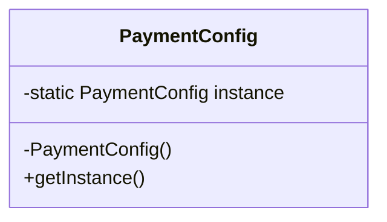

# Java Design Patterns (GoF)

This repository contains implementations of the 23 Gang of Four (GoF) design patterns in Java.

Patterns are categorized into:
- Creational
- Structural
- Behavioral

Each pattern includes:
- Explanation
- UML diagram
- Java implementation
- Real-world example

---

# 📁 Creational Patterns

Focus: Object creation mechanisms.

## 1. Singleton
Ensures a class has only one instance and provides a global access point to it.

Diagram:

## 2. Factory Method
Defines an interface for creating objects but lets subclasses decide which class to instantiate.

Diagram:
Creator → ConcreteCreator → Product

## 3. Abstract Factory
Provides an interface to create families of related objects without specifying concrete classes.

Diagram:
AbstractFactory → ConcreteFactory → ProductA / ProductB

## 4. Builder
Separates construction of a complex object from its representation.

Diagram:
Director → Builder → ConcreteBuilder → Product

## 5. Prototype
Creates new objects by copying an existing instance (cloning).

Diagram:
Prototype → clone() → ConcretePrototype

---

# 📁 Structural Patterns

Focus: Composition of classes and objects.

## 6. Adapter
Converts one interface into another expected by clients.

Diagram:
Client → Adapter → Adaptee

## 7. Bridge
Decouples abstraction from implementation so both can vary independently.

Diagram:
Abstraction → Implementor → ConcreteImplementor

## 8. Composite
Composes objects into tree structures to represent part-whole hierarchies.

Diagram:
Component → Leaf / Composite

## 9. Decorator
Adds new behavior dynamically to an object without modifying its structure.

Diagram:
Component → Decorator → ConcreteDecorator

## 10. Facade
Provides a simplified interface to a complex subsystem.

Diagram:
Client → Facade → Subsystem

## 11. Flyweight
Reduces memory usage by sharing common object state.

Diagram:
FlyweightFactory → Shared Flyweight Objects

## 12. Proxy
Provides a surrogate or placeholder to control access to another object.

Diagram:
Client → Proxy → RealSubject

---

# 📁 Behavioral Patterns

Focus: Object communication and responsibility.

## 13. Observer
Defines a one-to-many dependency so that when one object changes state, all dependents are notified.

Diagram:
Subject → Observers

## 14. Strategy
Defines a family of algorithms and makes them interchangeable at runtime.

Diagram:
Context → Strategy → ConcreteStrategy

## 15. Command
Encapsulates a request as an object, allowing parameterization and queuing.

Diagram:
Invoker → Command → Receiver

## 16. Chain of Responsibility
Passes a request along a chain of handlers until one handles it.

Diagram:
Handler1 → Handler2 → Handler3

## 17. State
Allows an object to change behavior when its internal state changes.

Diagram:
Context → State → ConcreteState

## 18. Template Method
Defines the skeleton of an algorithm, allowing subclasses to override specific steps.

Diagram:
AbstractClass → ConcreteClass

## 19. Iterator
Provides a way to access elements of a collection sequentially without exposing structure.

Diagram:
Iterator → ConcreteIterator

## 20. Mediator
Defines an object that encapsulates communication between objects.

Diagram:
Colleague → Mediator → Colleague

## 21. Memento
Captures and restores an object's internal state without exposing details.

Diagram:
Originator ↔ Memento ↔ Caretaker

## 22. Visitor
Represents an operation to be performed on elements of an object structure.

Diagram:
Visitor → ConcreteElement

## 23. Interpreter
Defines a representation for a grammar and an interpreter to evaluate sentences.

Diagram:
Expression → TerminalExpression / NonTerminalExpression

---

# 🎯 Purpose of This Repository

- Strengthen object-oriented design principles
- Demonstrate SOLID principles in action
- Improve architectural thinking
- Prepare for senior backend and system design interviews