# Java Design Patterns (GoF)

This repository contains implementations of the 23 Gang of Four (GoF) design patterns in Java.

Patterns are categorized into:
- Creational
- Structural
- Behavioral


🏦 Domain Context Used

- Banking Real-Time-Payment System supporting:

    - IMPS (Instant)
    - NEFT (Batch-based,Low Value)
    - RTGS (High value)
    - Cross-border SWIFT


Each pattern includes:
- Explanation
- UML diagram
- Java implementation
- Real-world example

---

# 📁 Creational Patterns

Focus: Object creation mechanisms.

## 1. Singleton -PaymentConfiguration
Ensures single configuration instance for payment gateway routing.

Diagram:
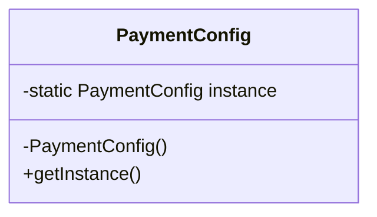

## 2. Factory Method - PaymentProcessorFactory
Chooses processor based on type (IMPS, NEFT, RTGS).

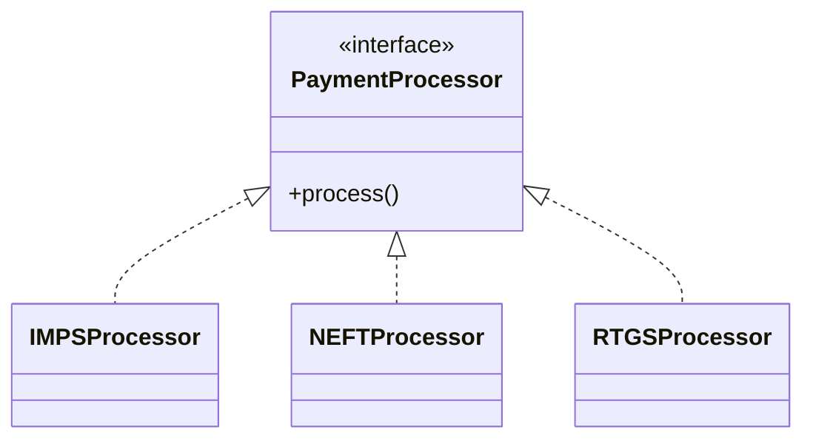

## 3. Abstract Factory – Domestic vs CrossBorder

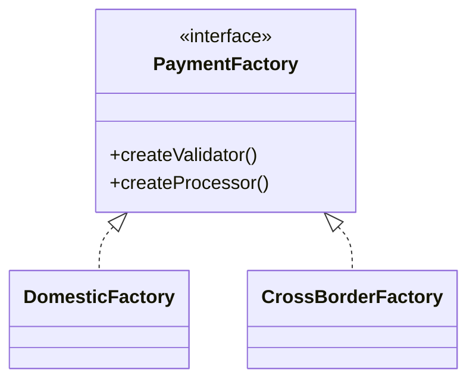

## 4. Builder – PaymentRequest Builder

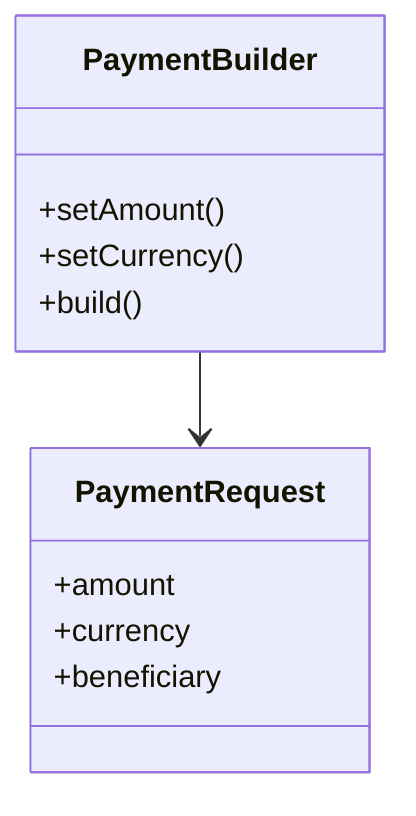

## 5. Prototype – Clone Transaction Template

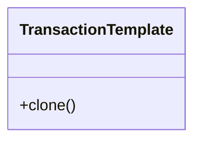

---

# 📁 Structural Patterns

Focus: Composition of classes and objects.

## 6. Adapter – SWIFT Adapter

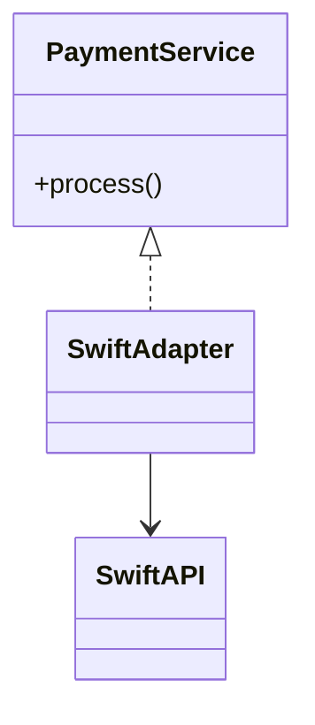

## 7. Bridge – Payment + Channel
Decouples abstraction from implementation so both can vary independently.
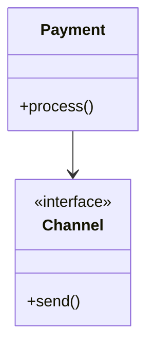

Diagram:
Abstraction → Implementor → ConcreteImplementor

## 8. Composite
Composes objects into tree structures to represent part-whole hierarchies.

Diagram:
Component → Leaf / Composite

## 9. Decorator – Fraud Check Layer
Adds new behavior dynamically to an object without modifying its structure.

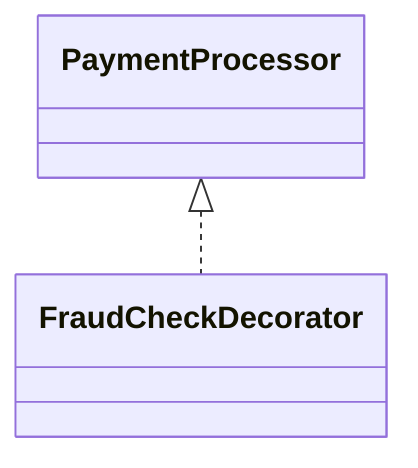

## 10. Facade – PaymentFacade
Provides a simplified interface to a complex subsystem.

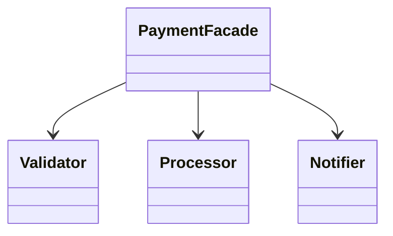

## 11. Flyweight – Currency Metadata
Reduces memory usage by sharing common object state.

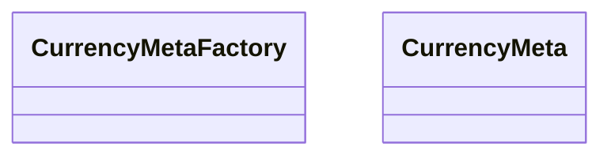

## 12. Proxy – Authorization Proxy
Provides a surrogate or placeholder to control access to another object.

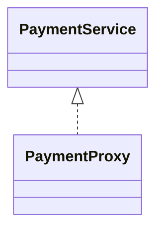

---

# 📁 Behavioral Patterns

Focus: Object communication and responsibility.

## 13. Observer – Transaction Status Update
Defines a one-to-many dependency so that when one object changes state, all dependents are notified.

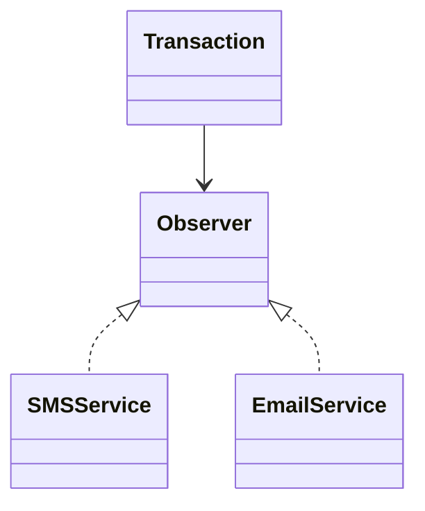

## 14. Strategy – Payment Fee Strategy
Defines a family of algorithms and makes them interchangeable at runtime.

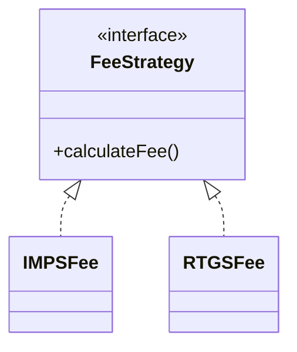

## 15. Command – PaymentCommand
Encapsulates a request as an object, allowing parameterization and queuing.

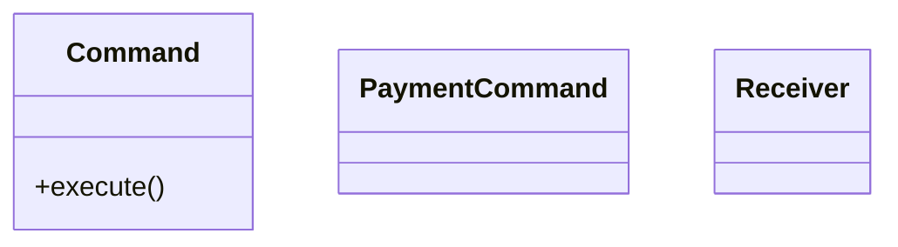

## 16. Chain of Responsibility – Validation Chain
Passes a request along a chain of handlers until one handles it.

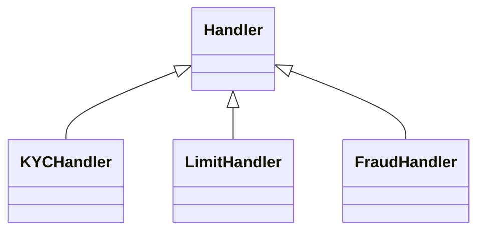
## 17. State – PaymentState
Allows an object to change behavior when its internal state changes.

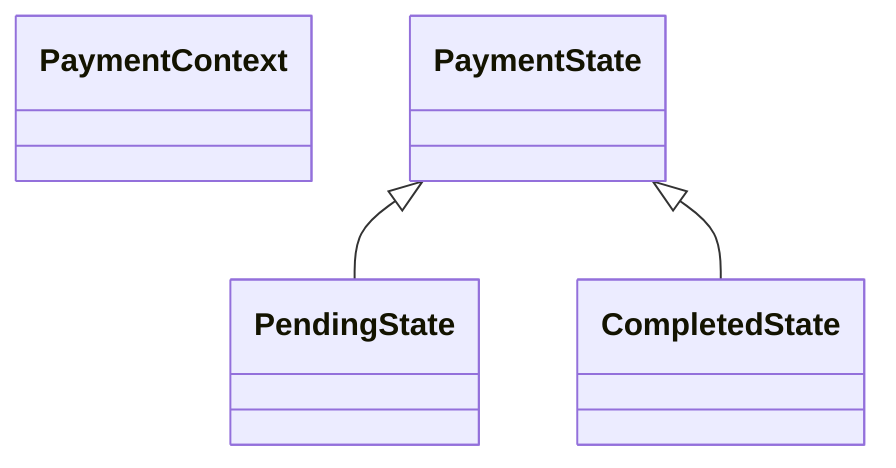

## 18. Template Method – Settlement Process
Defines the skeleton of an algorithm, allowing subclasses to override specific steps.

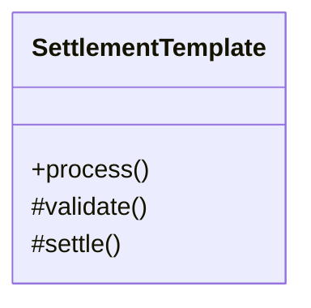

## 19. Iterator – TransactionIterator
Provides a way to access elements of a collection sequentially without exposing structure.

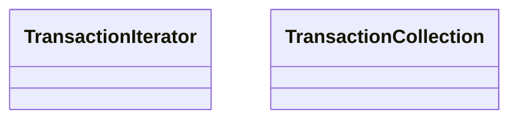

## 20. Mediator – PaymentGatewayMediator
Defines an object that encapsulates communication between objects.

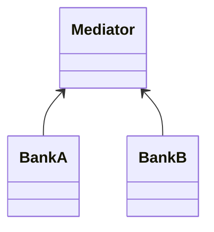

## 21. Memento – Rollback Transaction
Captures and restores an object's internal state without exposing details.

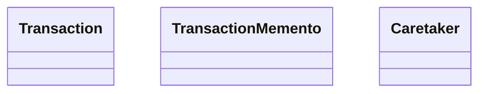

## 22. Visitor – Compliance Audit Visitor
Represents an operation to be performed on elements of an object structure.

```mermaid
classDiagram
    class Visitor
    class IMPSPayment
    class RTGSPayment

    Visitor --> IMPSPayment
    Visitor --> RTGSPayment
```

## 23. Interpreter – Payment Rule Engine
Defines a representation for a grammar and an interpreter to evaluate sentences.

```mermaid
classDiagram
    class Expression
    class TerminalExpression
    class NonTerminalExpression
```

---

# 🎯 Purpose of This Repository

- Strengthen object-oriented design principles
- Demonstrate SOLID principles in action
- Improve architectural thinking
- Prepare for senior backend and system design interviews