# 📁 Behavioral Patterns

Focus: Object communication and responsibility.

## 13. Observer – Transaction Status Update
Defines a one-to-many dependency so that when one object changes state, all dependents are notified.

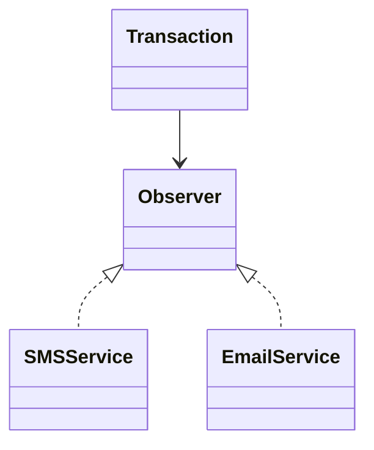

## 14. Strategy – Payment Fee Strategy
Defines a family of algorithms and makes them interchangeable at runtime.

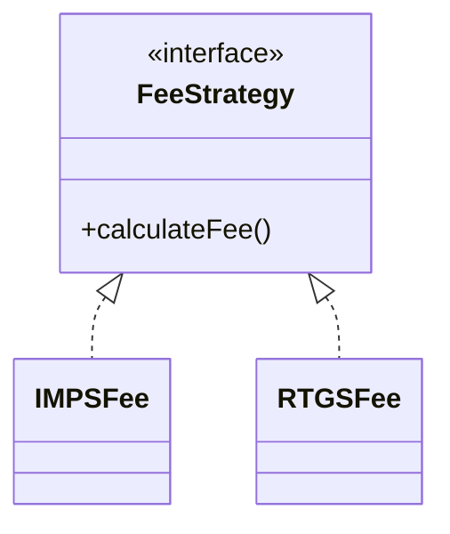

## 15. Command – PaymentCommand
Encapsulates a request as an object, allowing parameterization and queuing.

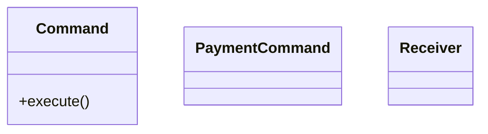

## 16. Chain of Responsibility – Validation Chain
Passes a request along a chain of handlers until one handles it.

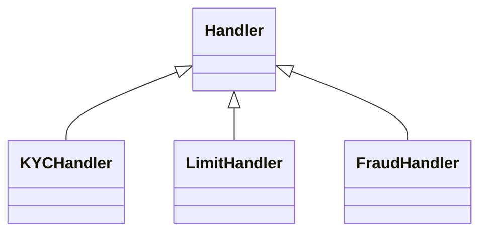
## 17. State – PaymentState
Allows an object to change behavior when its internal state changes.

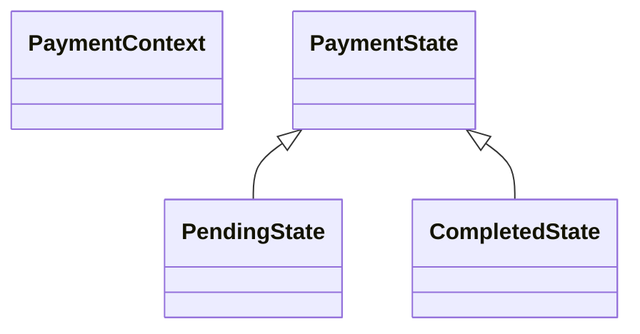

## 18. Template Method – Settlement Process
Defines the skeleton of an algorithm, allowing subclasses to override specific steps.

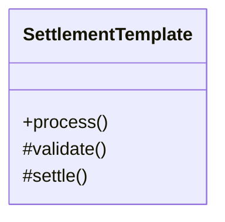

## 19. Iterator – TransactionIterator
Provides a way to access elements of a collection sequentially without exposing structure.

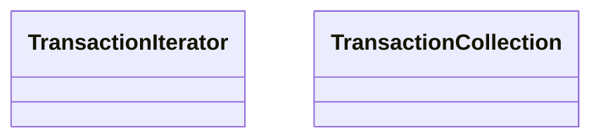

## 20. Mediator – PaymentGatewayMediator
Defines an object that encapsulates communication between objects.

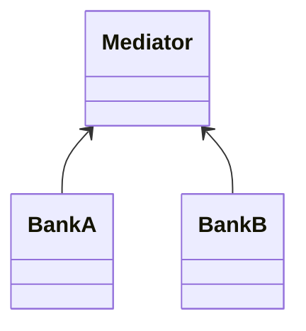

## 21. Memento – Rollback Transaction
Captures and restores an object's internal state without exposing details.

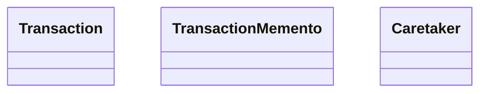

## 22. Visitor – Compliance Audit Visitor
Represents an operation to be performed on elements of an object structure.

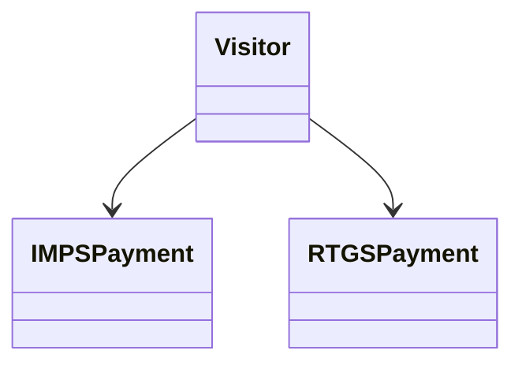

## 23. Interpreter – Payment Rule Engine
Defines a representation for a grammar and an interpreter to evaluate sentences.

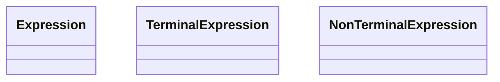
