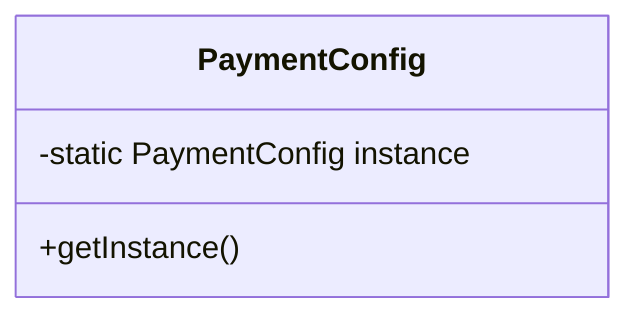
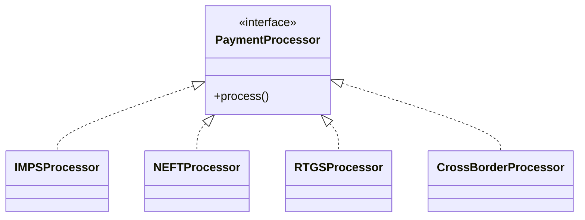
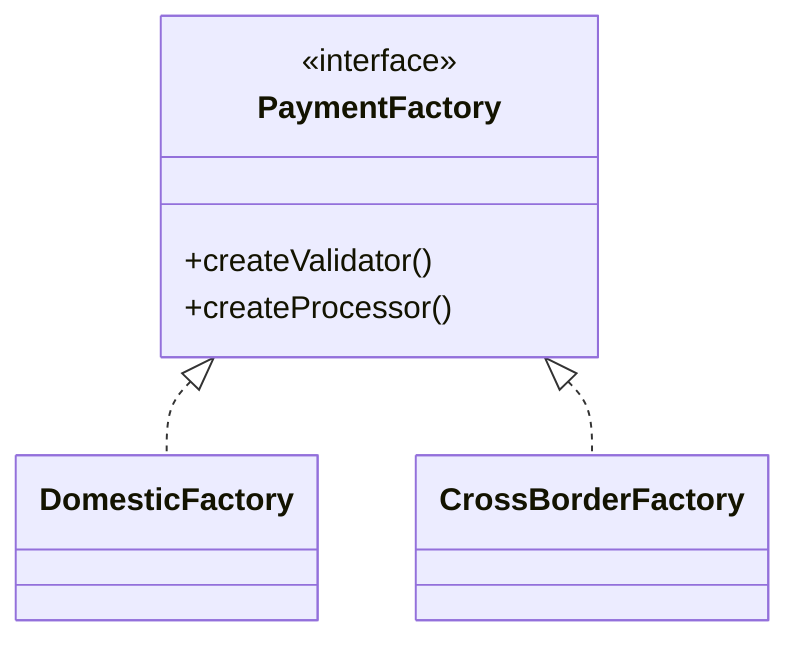
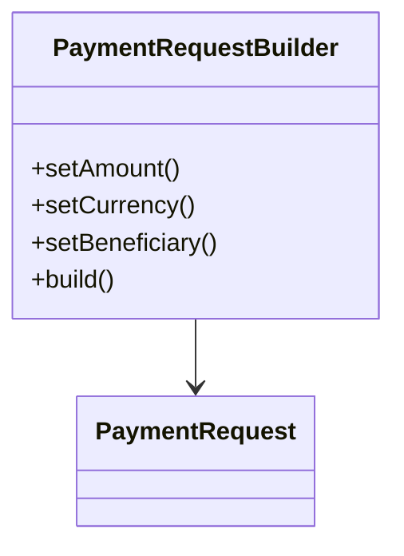
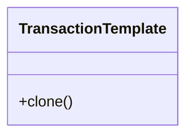

### 📁 Creational Design Patterns – Applied to Payment Systems

Creational patterns deal with object creation mechanisms and lifecycle management.
In payment and cross-border remittance platforms, these patterns are critical for:
 - Dynamic processor routing (IMPS / NEFT / RTGS / SWIFT)
 - Regional abstraction (Domestic vs Cross-border)
 - Immutable transaction construction
 - Centralized configuration management
 - Template reuse for recurring remittances

---

### 1️⃣ Singleton – Centralized Configuration

#### 🔎 Intent

Ensure a class has only one instance and provide a global access point.

#### 🏦 Payment Use Case

Used for:

- FX configuration
- Routing tables
- Risk thresholds
- Settlement window configuration

High-throughput payment engines require consistent configuration across threads.

🌱 Where Spring Uses Singleton

Spring Beans are Singleton by default.

Internally:

- ApplicationContext manages bean lifecycle
- Only one bean instance per container (default scope)
- Caching of bean instances in DefaultSingletonBeanRegistry
  Spring itself heavily relies on Singleton pattern for:

- Service beans
- Repository beans
- Configuration classes
###  2️⃣ Factory Method – Processor Routing
  🔎 Intent

Define an interface for creating an object, but let subclasses decide which class to instantiate.

🏦 Payment Use Case

Route to:

- IMPSProcessor
- NEFTProcessor
- RTGSProcessor
- CrossBorderProcessor
  Avoids hard-coded conditional logic in orchestration layer.

🌱 Where Spring Uses Factory Method

Spring internally uses Factory Method pattern in:

- BeanFactory
- FactoryBean<T>
- ObjectFactory<T>

Example:
FactoryBean allows Spring to decide how to create complex beans (like Proxy objects, Hibernate Sessions, etc.).

Spring container itself acts as a large factory of objects.

### 3️⃣ Abstract Factory – Domestic vs Cross-Border Suites
🔎 Intent

Provide an interface for creating families of related objects.

🏦 Payment Use Case

Domestic Suite:

- DomesticValidator
- DomesticProcessor
- DomesticFeeCalculator
  Cross-Border Suite:
- SanctionValidator
- FXProcessor
- SWIFTAdapter

🌱 Where Spring Uses Abstract Factory

Spring uses Abstract Factory in:

- ApplicationContext hierarchy
- AbstractApplicationContext
- ConfigurableApplicationContext

Spring Boot auto-configuration also behaves like Abstract Factory:
Different configuration classes create families of related beans depending on environment (Web, Reactive, Security, JPA,
etc.).

### 4️⃣ Builder – Immutable PaymentRequest Construction
🔎 Intent

Separate the construction of a complex object from its representation.

🏦 Payment Use Case

Cross-border payment requires:

- Amount
- Currency
- Beneficiary
- FX Rate
- Compliance Metadata
- Purpose Code
  Builder ensures:
- Controlled construction
- Immutability
- Validation before creation

🌱 Where Spring Uses Builder

Spring uses Builder pattern in:

- UriComponentsBuilder
- MockMvcBuilders
- WebClient.Builder
- RestTemplateBuilder
- SecurityFilterChainBuilder 
- Spring Boot configuration builders are heavily Builder-based.

### 5️⃣ Prototype – Transaction Template Cloning
🔎 Intent

Create new objects by copying an existing instance.

🏦 Payment Use Case

Recurring remittance templates:

- Same beneficiary
- Same corridor
- Same compliance structure
- Clone and adjust amount/date

🌱 Where Spring Uses Prototype

Spring supports Prototype scope:

- @Scope("prototype")

- New instance created every time requested

- Used for stateful beans

Also used internally when cloning bean definitions in certain container operations.

🧠 Why Creational Patterns Matter in Payment Platforms

In cross-border remittance systems:

- Object creation must be controlled

- Regional differences must be isolated

- Configuration must be centralized

- Complex objects must remain immutable

- Routing must be extensible

Creational patterns ensure:

- Loose coupling

- Extensibility

- Clean orchestration design

- Production-level maintainability