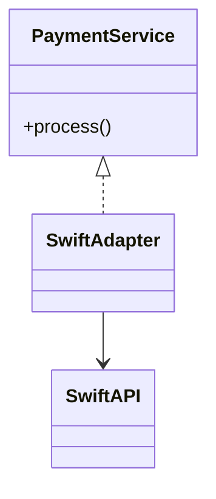
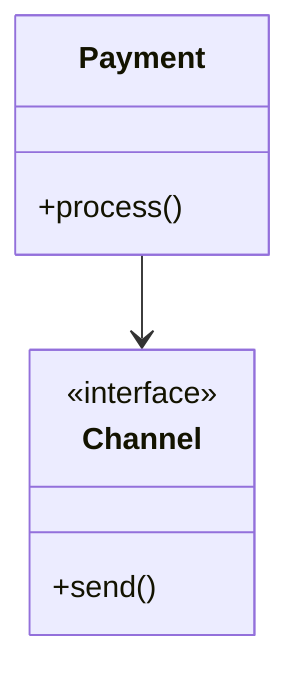
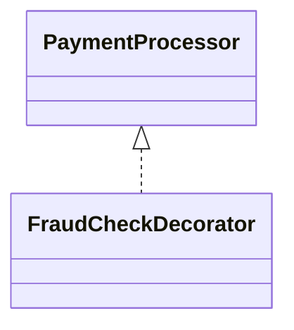
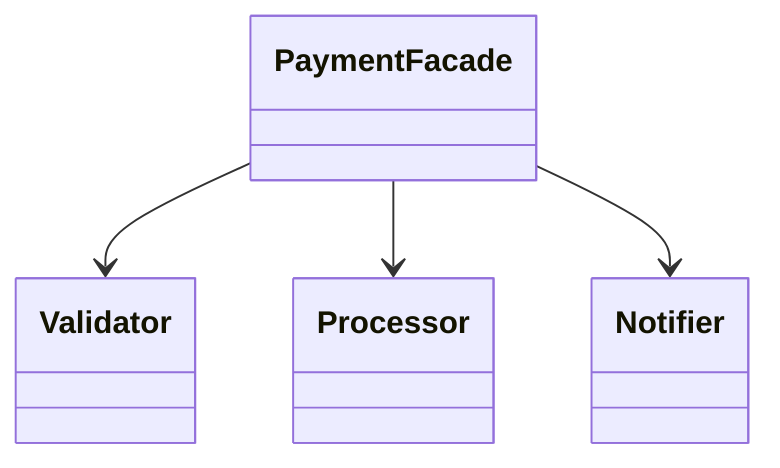
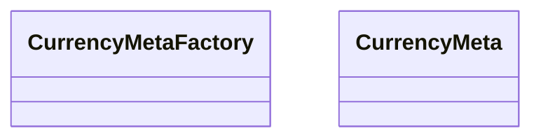
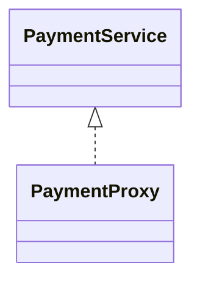

# 📁 Structural Patterns

Focus: Composition of classes and objects.

## 6. Adapter – SWIFT Adapter

## 7. Bridge – Payment + Channel
Decouples abstraction from implementation so both can vary independently.

Diagram:
Abstraction → Implementor → ConcreteImplementor

## 8. Composite
Composes objects into tree structures to represent part-whole hierarchies.

Diagram:
Component → Leaf / Composite

## 9. Decorator – Fraud Check Layer
Adds new behavior dynamically to an object without modifying its structure.

## 10. Facade – PaymentFacade
Provides a simplified interface to a complex subsystem.

## 11. Flyweight – Currency Metadata
Reduces memory usage by sharing common object state.

## 12. Proxy – Authorization Proxy
Provides a surrogate or placeholder to control access to another object.

